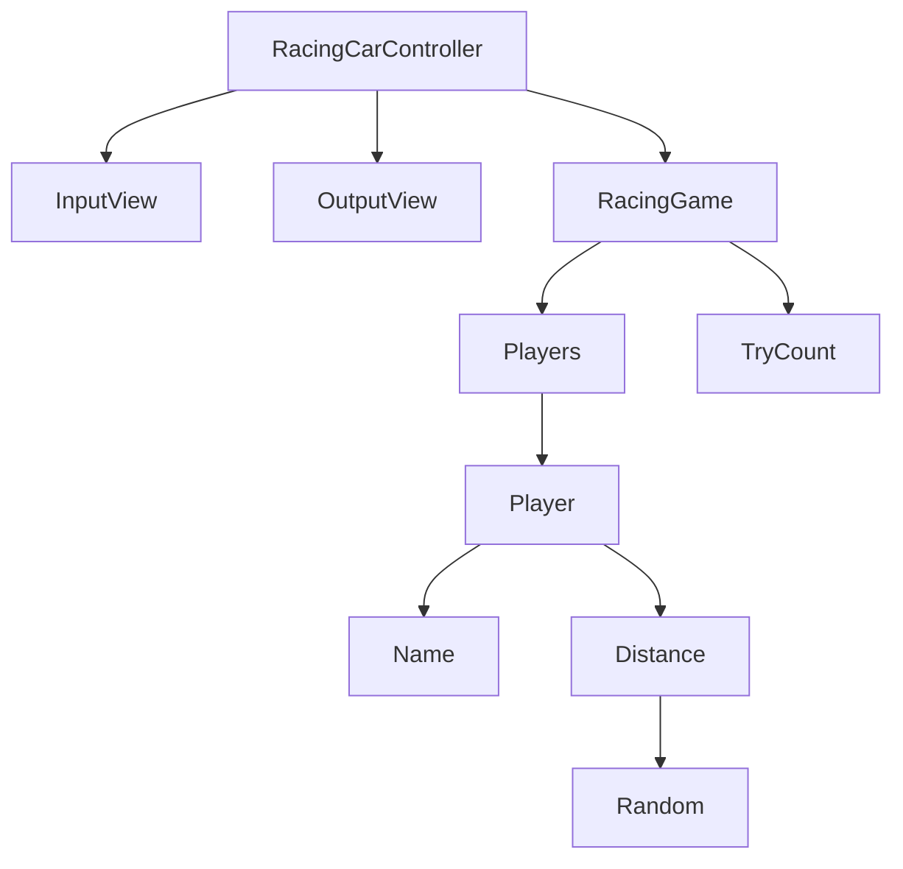

# java-racingcar

자동차 경주 미션 저장소

## 도메인 다이어그램

## 기능 구현 목록

### RacingGame

- [x] Player와 Trycount 관리한다.

### Players

- [x] 여러 명일 수 있다.

### Player

- [x] 이름을 가진다.
    - [x] 최소 1자, 최대 5자까지 가능하다.
    - [x] 중간 공백은 허용하고 쉼표로 구분한다.
- [x] 거리를 가진다.

### 입력

- [x] 플레이어의 이름을 입력한다.
    - [x] 앞, 뒤 공백은 제거한다.
- [x] 이동 횟수를 입력한다.

### 출력

- [x] 최종 결과를 출력한다.
- [x] 최종 우승자를 출력한다.
    - [x] 여러명일 수 있다.
  
